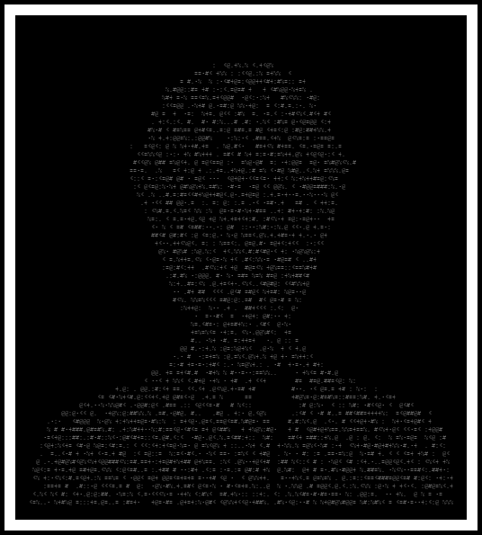

  

  

  

  
  
  

  

## About Me

- Cybersecurity student currently learning security fundamentals
- Working toward becoming a Cloud Security Analyst
- Interested in cloud platforms (AWS, Azure) and how they're secured

 
 

## Arsenal

  
  
  
  
  
  
  
  
  
  
  
  

 

## Achievements

- Certification: none yet - CompTIA Security+ or AWS Cloud Practitioner planned
- TryHackMe / HackTheBox: no rooms completed yet
- Cloud Project: none published yet
- CTF: no competitions entered yet
- Write-up: none published yet

 

## Stats

  

  

 

## Contribution Snake

  

<i>Note: this animated snake needs a one-time setup below to start working.</i>

 

## Contact

  
  

  

  

